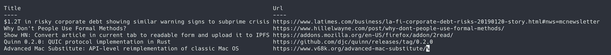

# HackerNews Go

[](https://github.com/JoseThen/HN-GO/blob/master/.github/workflows/test_master.yaml)

A HackerNews client writtent in Go

---

## Usage

To get the top stories

```
hn top
```

To get most recent (new) stories

```
hn new
```

-   The default number of stories for both subcommands is 15. You can change that by using the `--num` or `-num` flag
-   If you do not build the executable then you can simply do `go run hn.go top --num 30`

## Output

When running a command you will get 2 columns for Title and URL in your terminal:

